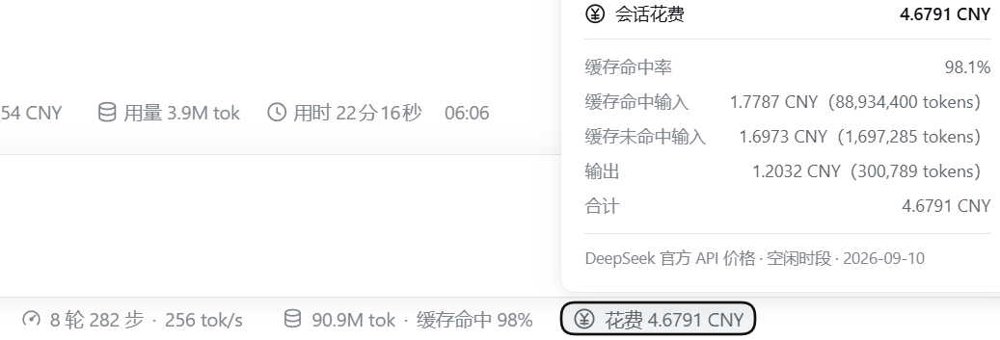
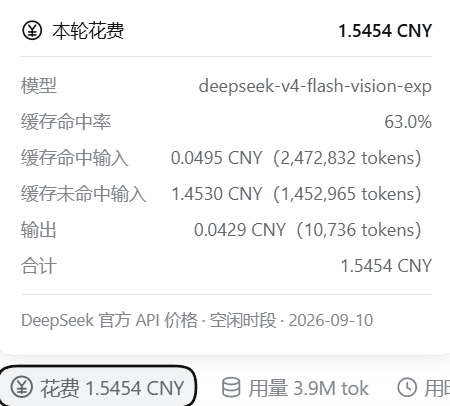

# dsh-turn-cost

本项目目的是制作一个简单的计价显示，使用与DSH本体用量、用时显示一致的外观，显示单轮对话及整个会话**按 DeepSeek 官方 API 价格计算**的花费。
本项目代码及文档由 WSL 环境 DSH 中调用 deepseek-v4-flash-vision-exp 路由的 deepseek-v4.1-flash 开发或生成，人类只进行了需求、审查和文档微调。

| 会话累计 | 每轮花费 |
|---|---|
|  |  |

左图：输入框下方与「轮/步 · 速度」「总 token · 缓存命中率」同排的会话花费，点开是整段会话的累计明细。
右图：每轮回答尾部动作行里的花费 pill（标签末尾的 `含子代理 N` 表示该轮有 N 个子代理计入），点开是本轮明细。
**截图为早期开发版本内容，仅用于粗略展示功能，实际UI请以使用实测为准**。

---

> 界面截图中 DSH / DeepSeek 商标归其所有者。

## 插件功能

- **每轮花费**：读取该轮实际发生的每次模型请求，按请求时刻的官方单价计价后求和；弹窗给出**本轮用的模型、缓存命中率**，以及**缓存命中输入 / 缓存未命中输入 / 输出**三项各自的 token 数与对应金额、合计。**该轮调用的子代理也会计入本轮**（见下条）。
- **会话累计**：把各轮花费逐轮累加，每一轮用的是当次请求的模型与价格；翻页、滚动、上下文压缩、分叉都不会让数字变化。
- **弹窗可以翻页看总计与每个代理的明细**：点开任意一个花费弹窗，明细区下方就是一条极简翻页控件 `‹ 2/4 ›`。有子代理时**第 1 页是总计**（三桶与合计，末尾一行 `由 N 个代理构成 : 主 Agent x CNY + 子代理 y CNY` 说明钱花在谁身上）、**第 2 页是主 Agent**（会话 pill 是"本会话自身"，每轮 pill 是"本轮自身"）、**第 3 页起每个子代理一页**（名称 / 模型 / 三桶 / 合计 / 归属轮次）。**没有子代理时弹窗就是单页**（与分页前逐条一致），不出现任何翻页控件。
- **翻页怎么操作**：点 `‹` / `›`，或按 `←` / `→` 前后翻（到两端就停住）；按 `Enter` 循环翻到下一页（最后一页回到第 1 页），连按即可把每页过一遍；`Esc` 关闭弹窗（`Esc` 是原生弹窗本来就有的行为）。子代理个数变化导致页数变少时，当前页会自动夹到最后一页，不会看到空白页。
- **子代理（subagent）**：子代理是独立会话，花费记在它自己的日志里。插件按官方会话列表把**全部后代子会话**（含孙代）的花费聚合进来：会话 pill 的金额 = 本会话自身 + 各子代理自身，弹窗按上面的页序逐页查看总计与各代理明细，并在标签上标 `含子代理 N`；每轮 pill 分页里的子代理页**只包含该轮调用的**子代理。归属规则是"按子代理那一轮的开始时刻落进本会话的对应轮次"，取不到时刻时退回它被创建的轮次并在弹窗里标注 `按创建轮归属`。
- 两个弹窗底部都有一行脚注说明计价依据，例如 `DeepSeek 官方 API 价格 · 空闲时段 · 2026-09-10`；**每一页都保留这行脚注**，翻到哪一页都知道数字是按什么价算的。

## 实现方式

插件不改动DSH官方源码，不覆盖任何原生UI：

1. **host 侧**注册一个 session「投影单元」——DSH 原生的投影接缝（与官方 `tokenUsage` / `sessionStats` 同一种机制）。订阅、水位、变更推送、持久缓存全由框架负责，插件只贡献一个纯折叠函数；这正是数字不受分页 / 压缩影响的原因。
2. **client 侧**只向两个 **list 槽位**（输入框下的会话统计行、每轮的动作行）**追加**条目，并只移动**自己**的节点去对齐到原生「用量」pill 旁边；不替换、包裹或隐藏任何原生元素。
3. **卸载即净**：移出插件后两个 pill 与投影一起消失，无残留。插件内任何一环失败（找不到锚点、注册冲突、渲染异常）都只会降级为"自己不显示"或"退回原位"，在设计上不会影响 DSH 本身。

## 如何计价

- **区分消耗token类型**：缓存命中输入（`prompt_cache_hit_tokens`）、缓存未命中输入（`prompt_tokens − 命中`）、输出（`completion_tokens`；思维链已含在输出内，不重复计费）。
- **单价**：DeepSeek官方API价格，以人民币计价，按「模型家族 + 生效时间」版本化，并按请求时刻自动区分高峰 / 空闲（峰价 = 谷价 × 2；高峰为北京时间周一至周五 09:00–12:00、14:00–18:00）。例如 flash 系列当前空闲价为 **¥0.02 / ¥1 / ¥4**（每百万 token 的命中 / 未命中 / 输出），`deepseek-v4-pro` 按其自身价。历史会话用**当时**的价格（8/17 峰谷启用、8/23 起周末全天谷价、9/10 flash 降价，均已收录）。
- **精度**：金额以**微元整数**累加（`round(tokens × 元/百万)`），无浮点漂移；显示为 `花费 1.1451 CNY`，不足 0.0001 元显示 `<0.0001 CNY`。
- **与原生口径逐条对齐**：同一 `(turn, step)` 的流式样本会被最终样本**替换**；失败重试的每一次请求都**真实累加**（`llm/retry-started` 之后不清零）。
- 未收录模型按同类价估算并在弹窗标注；**非 DeepSeek 官方 provider 的路由**（例如经 DSH 官方 `llm-pi-ai` 适配器接入的第三方模型）默认不计价，其请求该轮不显示花费（其他被计价的请求照常累计），可用插件配置 `pricedProviders` 放开（配置写在 profile 的 `cordis.patch.yml` insert 行 `config` 里）。
- **口径边界（重要）**：以上数字是「官方公开价目表 × provider 上报 token」推算出的**估算值**，不等于 DeepSeek 开放平台的最终账单，**以开放平台为准**。会话花费与每轮花费**已包含子代理会话**（按官方会话列表聚合全部后代子会话，见上条）；仍**不包含**标题生成、联网搜索（`web/deepseek-search-llm-request`）这类同会话内但不走计价请求的旁路调用——平台会为这些请求扣费，但本插件的「会话花费」看不到。

## 免责与口径

> 本插件所显示的花费，是**基于 DSH 提供的接口获取 token 消耗并计算**得到的，仅为方便查看每一轮次、每一会话的**大致开销**使用；本插件**不保证**花费显示准确无误，**实际价格花费仍应以 DeepSeek 官方文档价格、以及官方开放平台余额与账单显示为准**。

技术口径边界（估算方式、包含与不包含哪些请求）见上一节「如何计价」。

## 安装（从 GitHub）

```bash
# 1) 克隆
git clone https://github.com/Quimos-M/dsh-turn-cost.git ~/dsh-plugins/dsh-turn-cost

# 2a) 如果你的 dsh 版本带 plugin 子命令（本项目的开发环境未实测该子命令；没有就用 2b）
dsh plugin --profile web add link:~/dsh-plugins/dsh-turn-cost

# 2b) 等价的手工两步（本插件的开发与验收全程走的就是这条）
#     编辑 profiles/web/package.json：
#       "dependencies": { "dsh-turn-cost": "link:/home/<你>/dsh-plugins/dsh-turn-cost" }
#       "dsh": { "profile": { "bundles": [ ..., "dsh-turn-cost" ] } }
#     profiles/web/node_modules 下若没有指向该目录的链接，先建一个

# 3) 重启 dsh web —— bundle 在启动时装配
```

也支持 tgz：

```bash
npm pack   # 产出 dsh-turn-cost-0.1.0.tgz
# 装配方式同 2a 的说明（该子命令未在本项目开发环境实测；等价手工法见 2b）
dsh plugin --profile web add ./dsh-turn-cost-0.1.0.tgz
```

> 卸载 = 从 profile 的 `bundles` 与 `dependencies` 移除 `dsh-turn-cost` 后重启 dsh web；两个 pill 与投影注册一并消失，无残留。

## 版本兼容性

- 开发与验收环境：**DSH `0.1.5-rc.1`**（2026-09 构建）实测通过；同一 minor 版本**预期**可用（依赖面见下三条）。
- 只使用**公共接缝**：session 投影注册表、两个 list 槽位（新 id 追加）、客户端平台模块表（`react`、`@deepseek-ai/dsh-client-ui-primitives` 等），以及框架以 props 交付的全局标准座位 `useSessions`（官方会话列表，子代理聚合靠它读各会话的投影值——官方 ui-subagent 同款用法）。
- **host 半没有任何运行时 import**（只 import type），不存在"依赖缺失导致加载失败"的路径；client 半只 require 平台模块表内的模块（`lib/client.js` 的 require 恰好是那 4 个）。
- **降级**：子代理聚合所需的会话列表座位或某个子会话的投影值缺席时，子代理部分自动**不显示**，本会话自身的花费照常显示，不报错。
- 对页面 DOM 的依赖是**加固型**的：定位原生统计行/动作行用 `[data-composer-stats]`、`[data-turn-tail]` 与原生 pill 的 `aria-haspopup` / `aria-expanded`。这些锚点若找不到，pill 会**退回槽位原位**并在标签标 `· 未定位`，功能不丢、也不抛错；即使将来 DSH 改动这块 DOM，最坏情况只是位置退化。

## 共存与隔离

- 本插件只使用**公共接缝**：session 投影注册表 + 两个 **list 槽位**（全新 id 追加，不碰 chain / keyed / single 槽位），并只移动**自己**的节点去对齐原生「用量」pill；颜色一律走 DSH 主题变量。因此在同一份 DSH 上与其他改页面 / 界面的插件并存时，设计上不会互相覆盖：本插件不替换、不包裹、不隐藏任何非自己创建的元素。
- 这一条是**设计约束**，不是对任何具体插件组合的兼容性承诺；实际共存表现取决于对方的实现方式，请以你自己的实测为准。

---

## 已确认兼容的插件

针对同样会改动 DSH 页面 / 界面的插件，以下是在共存状态下实测得到的兼容性结论（本项目**不依赖**其中任何一个，装与不装都不影响其功能）：

| 插件 | 类型 | 兼容性结论 |
|---|---|---|
| `@dsh-external/dsh-client-ui-skin-orca-link` | 界面皮肤 | ✅ 共存正常 |
| `dsh-whale-widget` | 页面挂件 | ✅ 共存正常 |
| `dsh-better-sidebar` | 侧栏 / 编辑器 | ✅ 共存正常 |
| `@dsh-external/dsh-mode-boost` | 推理模式路由 | ✅ 共存正常 |
| ——（第三方插件全部停用） | 纯净 DSH 本体 | ✅ 两个 pill 照常工作 |

---

## 声明、维护与开发

- 本插件的 `build/tsdown.client.ts`、`build/web-platform.ts` 与两个 CSS 模块**派生自 DSH 官方源码**（MIT，`Copyright (c) 2026 DeepSeek`）：打包预设取自官方 `packages/client/tsdown.client.ts` 的形态；平台模块表取自官方 seed 表的子集；弹窗与 pill 的样式度量取自官方 `stat-dialog.module.css`、`StatsPills.module.css`、`TurnUsagePanel.module.css`（弹窗的分页控件与分页高度规则是**自创**的，只引用官方主题变量）；折叠语义（同槽替换 / 重试累加）对照官方 `token-meter` 实现、代码自写。逐文件派生程度的实测数字见 **[DESIGN.md](DESIGN.md)** 附录；上游版权与许可全文见 **[THIRD_PARTY_NOTICES.md](THIRD_PARTY_NOTICES.md)**。
- 价格表、实现细节、构建 / 测试方式、验收记录、已知边界与后续计划，见 **[DESIGN.md](DESIGN.md)**（面向开发者与 AI 协作者）。

## 许可

MIT —— 全文见 [LICENSE](LICENSE)，版权行 `Copyright (c) 2026 Quimos-M`。

第三方派生代码的上游版权与许可全文见 [THIRD_PARTY_NOTICES.md](THIRD_PARTY_NOTICES.md)；DSH / DeepSeek 商标归其所有者，本项目与 DeepSeek 官方**无隶属、合作或背书关系**。
